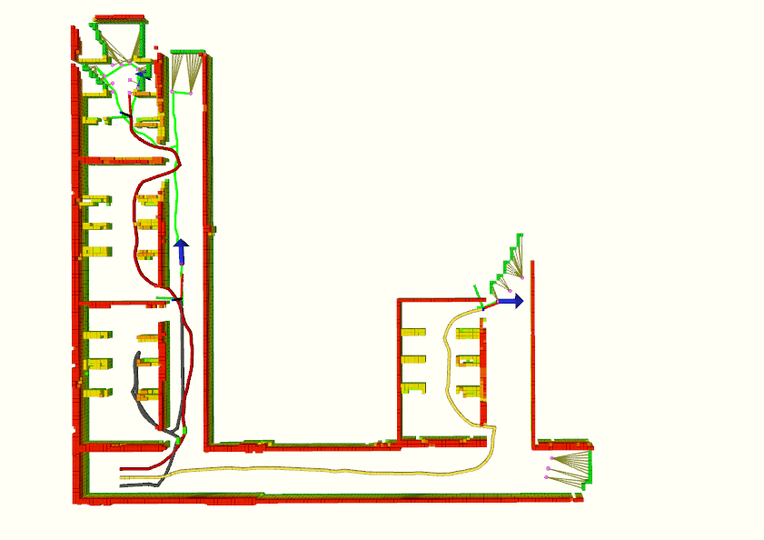

# DHC-ME
Code for paper DHC-ME: A Decentralized Hybrid Cooperative Approach for
Multi-Robot Autonomous Exploration (IROS 2025).

**Note**: The code is currently being uploaded and will be available soon. Please check back shortly for the complete repository.


## Video

## Prerequisites
**Note**: Please use a computer with a dedicated graphics card.

This project has been tested on **Ubuntu 20.04 (ROS Noetic)**, run the following commands to install required tools:

```bash
sudo apt-get install ros-noetic-navigation \
ros-noetic-gazebo-ros-control* \
ros-noetic-controller-* \
ros-noetic-tf2-* \
ros-noetic-octomap-* \
ros-noetic-velodyne-* \
ros-noetic-pointgrey-camera-description \
ros-noetic-twist-mux \
ros-noetic-teleop-twist-joy \
ros-noetic-lms1xx \
ros-noetic-interactive-marker-twist-server \
libgoogle-glog-dev \
libignition-common3-graphics-dev \
libignition-common3-profiler-dev \
python3-tk
```

## Compile
```bash
git clone https://github.com/NeSC-IV/DHC_ME.git
cd DHC_ME
catkin_make
```

## Run DHC-ME in simulation
After compilation you can start a sample exploration demo. You need to open 3 terminals at the same time, and run the following 3 commands in sequence.

- Open the simulation environment in the first terminal:
```bash
source devel/setup.bash && roslaunch exploration_manager multi_robot_sim_env.launch
```

**Note:** After running this command, please wait patiently until Gazebo has fully loaded the models before executing subsequent programs. The waiting time varies depending on the computer's performance.

- Run the local_planner in the second terminal:
```bash
source devel/setup.bash && roslaunch exploration_manager multi_robot_move.launch
```
- Start the exploration in the third terminal:
```bash
source devel/setup.bash && roslaunch exploration_manager multi_robot_exploration.launch
```
By default you can see an outdoor environment **scene_1.world**. The mobile robot will automatically start exploring after the file `multi_robot_exploration.launch` is run.

### Diagram of operational results


## Citation

## Acknowledgement
Thanks to the code of [patchwork-plusplus-ros](https://github.com/url-kaist/patchwork-plusplus-ross "patchwork-plusplus-ros") and [FAEL](https://github.com/SYSU-RoboticsLab/FAEL "FAEL") .

