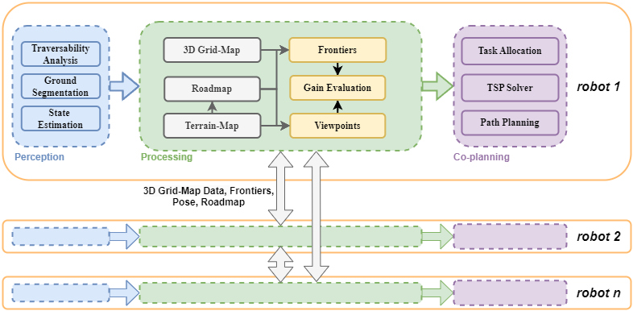

# DHC-ME
Code for paper DHC-ME: A Decentralized Hybrid Cooperative Approach for
Multi-Robot Autonomous Exploration (IROS 2025).


## Video

## Prerequisites
This project has been tested on **Ubuntu 20.04 (ROS Noetic)**, run the following commands to install required tools:

```bash
sudo apt-get install ros-noetic-navigation \
ros-noetic-gazebo-ros-control* \
ros-noetic-controller-* \
ros-noetic-tf2-* \
ros-noetic-octomap-* \
ros-noetic-velodyne-* \
ros-noetic-pointgrey-camera-description \
ros-noetic-twist-mux \
ros-noetic-teleop-twist-joy \
ros-noetic-lms1xx \
ros-noetic-interactive-marker-twist-server \
libgoogle-glog-dev \
libignition-common3-graphics-dev \
libignition-common3-profiler-dev \
python3-tk
```

## Compile and Run

## Citation

## Acknowledgement
